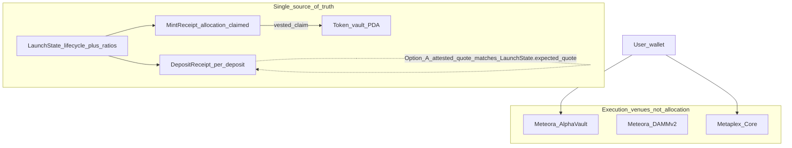

# Final architecture enforcement — on-chain financial truth

This document is the **post-refactor contract** for trust boundaries. Supabase, Next.js API routes, and Helius are **read-only / UX / indexing** for money outcomes.

**Product layering (routes, diagrams, user-facing definitions):** see [`docs/PRODUCT_ARCHITECTURE.md`](./PRODUCT_ARCHITECTURE.md).

---

## 1. Final ON-CHAIN truth model

**Option A (chosen):** `DepositReceipt` rows + `MintReceipt.allocation` derived **only** from `deposit_lamports * tokens_per_quote_num / tokens_per_quote_den` inside `record_genesis_participation`. Meteora vault balances are **not** mixed as a second allocation source in this program.

---

## 2. Final OFF-CHAIN responsibilities

| Layer | Allowed |
|-------|---------|
| **Next.js** | Render UI, build unsigned txs from **IDL / known layouts**, wallet connect, static copy |
| **API routes** | Auth gating, **read** pool state via RPC (`getPoolFeeBreakdown`), return 410 for removed planners |
| **Supabase** | Cache addresses, analytics, `fee_distributions` **audit** rows that mirror signed txs (amounts must match decoded txs, not invented) |
| **Helius** | Index logs → `chain_program_events`, DAS for **display** only |
| **Reputation** | Ranking, hysteresis cache — **must not** gate token payouts in backend |

### 2.1 Indexers (Helius / Supabase / cron jobs): read-only derivation

Indexers and scheduled jobs are **read-only derivation systems**. They may:

- compute analytics;
- aggregate history;
- power **UI** sorting, ranking, and discovery presentation.

They **must not**:

- determine **lifecycle** state (that is **`LaunchState`** and related on-chain accounts);
- determine **ownership** (wallets, PDAs, receipts — decode from chain or trust wallet-signed views, not DB inference as authority);
- determine **claim eligibility** (program checks + receipt state);
- determine **allocations** or any amount that settles value (derive from on-chain math / signed txs only).

**Rule:** Any field or branch that **affects a financial outcome** (who gets what, when they can claim, whether a launch is “active” for entitlement) **must** come from **on-chain state** (and client-built txs that the program will accept), not from indexer-derived flags alone.

### 2.2 `damm_pool` and other cached addresses (infra only)

- **`collections.damm_pool`** (and similar mirrored pubkeys) are **infrastructure metadata**: explorers, copy-paste, Helius bump invalidation, deploy UX.
- They are **never** lifecycle authority: do not use `IS NOT NULL`, `EXISTS`, or derived “phase” for **rewards**, **claims**, **NFT evolution gates**, or **allocation**.
- The **only** lifecycle source of truth is **`LaunchState` on the Anchor program** (e.g. `TRADING_ACTIVE`). The discovery API (`GET /api/launches/index`) does **not** query on `damm_pool` (no `IS NOT NULL` / `NOT NULL` predicates); any DAMM pool hint stays on cards for display only and must not be copied into payout or evolution logic.

### 2.3 Supabase schema (historical migrations only)

Forward migrations under `supabase/migrations/` may still **drop** old column names that existed before the Alpha Vault + DAMM v2 stack. Those identifiers appear only in **DDL**, not in application config or runtime reads.

---

## 3. Removed backend authority functions

| Removed / disabled | Was doing |
|--------------------|-----------|
| `planClaimAndDistribute` | Computed SOL holder shares from Helius snapshot + weights |
| `buildHolderPayoutTx` | Built batched SystemProgram transfers from server plan |
| `planTokenDistribution` | Computed SPL per-holder amounts |
| `buildTokenPayoutTx` | Built SPL transfer batches from server plan |
| `GET /api/.../distribute` (old) | Returned `payoutBatches` from server math |
| `POST /api/.../distribute` | Accepted client `holderPayouts` into DB |
| `GET/POST /api/.../reward-holders` | Snapshot + token batch planning |
| `deploy` route `status = live` | Supabase pretending to be lifecycle authority |

---

## 4. Anchor account map (final)

| Account | PDA seeds | Role |
|---------|-----------|------|
| `LaunchState` | `["launch", collection_mint]` | Authority, `alpha_vault`, lifecycle enum, `expected_quote_per_mint`, `tokens_per_quote_{num,den}`, vesting params, `deposit_seq`, token vault owner |
| `DepositReceipt` | `["deposit", launch, seq_le]` | Immutable proof of one genesis quote deposit |
| `MintReceipt` | `["mint_rcpt", launch, asset_mint]` | `allocation`, `claimed`, `vault_tier`, `entry_ts`, owner |
| Vault ATA | ATA(mint=`project_mint`, auth=`LaunchState`) | SPL custody for claims |

**Instructions:** `initialize_launch`, `set_alpha_vault`, `advance_lifecycle`, `record_genesis_participation`, `claim`.

---

## 5. Transaction flows

### Deposit (genesis path)

1. User signs **Meteora Alpha Vault deposit** ix (existing SDK builder).
2. **Same transaction (required next step):** append `record_genesis_participation` with `deposit_lamports == expected_quote_per_mint`, matching `deposit_seq`, and the Core `asset_mint` pubkey — writes `DepositReceipt` + `MintReceipt`.
3. Until (2) is wired in `build-alpha-vault-hybrid-mint-tx`, Meteora still holds liquidity but **this program** does not yet record receipts automatically (integration TODO).

### Mint

- Metaplex Core mint continues in the hybrid tx; NFT attrs include **`launchId`**, **`vaultTier`**, **`entryTs`** (immutable at mint).

### Claim

- Beneficiary signs `claim` when `LaunchState.lifecycle == CLAIM_ACTIVE` and vesting math allows; SPL moves from vault ATA to beneficiary ATA; `MintReceipt.claimed` updates on-chain.

---

## 6. Failure modes eliminated

- **Forged holder lists:** server can no longer POST arbitrary `holderPayouts`.
- **Helius snapshot as source of payout:** removed; snapshot APIs return 410.
- **Supabase `status=live` as mint gate:** removed; mint uses `canPublicMintGenesisPass` (vault + collection mirrors only).
- **Authority `register_pass` arbitrary allocation:** removed from program; allocation only from fixed quote + ratio.

---

## 7. Remaining risks

1. **`record_genesis_participation` not yet in the hybrid mint tx** — user could deposit to Meteora without recording; mitigation: append ix + fail whole tx if CPI ordering fails.
2. **Attested quote model** — user passes `deposit_lamports`; program checks equality to `expected_quote_per_mint` but does not yet CPI-verify Meteora vault delta in the same ix (future hardening).
3. **`collections` row** — still caches addresses for UX; must not be trusted for allocation — only PDAs + receipts.

---

## Appendix: lifecycle enum (on-chain)

`DRAFT(0) → VAULT_OPEN(1) → MINT_ACTIVE(2) → TRADING_ACTIVE(3) → CLAIM_ACTIVE(4) → FINALIZED(5)` — transitions only via `advance_lifecycle` signed by `LaunchState.authority`.
