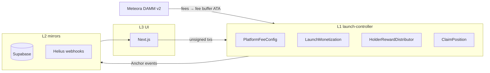
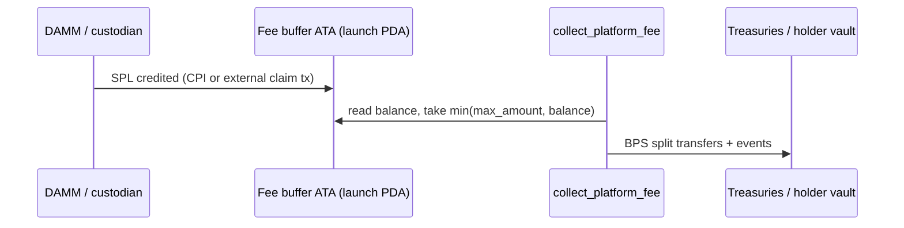
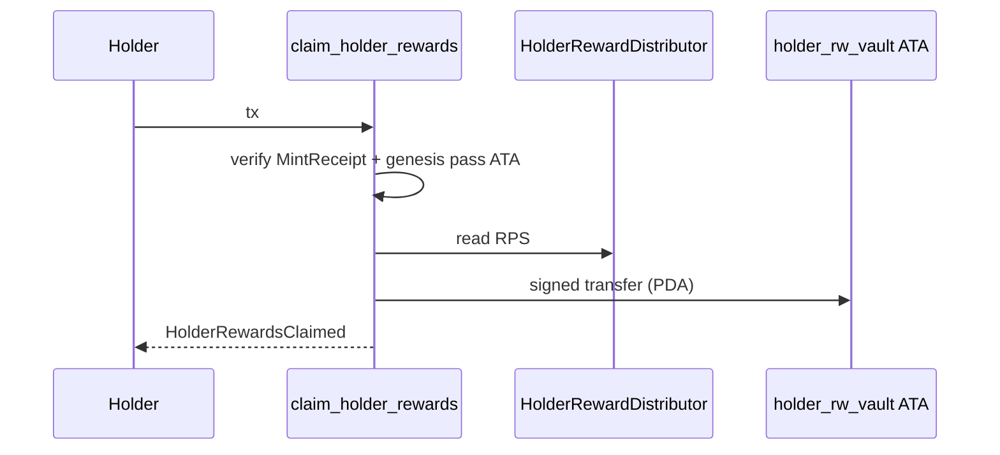

# On-chain fees, taxes, and holder rewards

This document is the **single product spec** for Creator Launchpad monetization. **L1 (Anchor `launch-controller`)** is the only financial authority. **L2** (Supabase, Helius) mirrors chain events and balances for analytics only. **L3** (Next.js) reads RPC, builds transactions, and shows **non-authoritative** estimates.

---

## Architecture (L1 / L2 / L3)

| Layer | Responsibility | Must not |
|-------|----------------|----------|
| **L1** | PDAs, BPS splits, reward index, claims, events | Trust Supabase or APIs for entitlement |
| **L2** | Ingest Anchor events + token transfers; APR/volume mirrors | Store canonical `claimable`, run payout planners |
| **L3** | RPC + tx builders + UX copy (“estimated from chain”) | Compute authoritative rewards, persist entitlements |

---

## Account model (Rust)

| Account | PDA seeds | Role |
|---------|-----------|------|
| `PlatformFeeConfig` | `["platform_fee_config"]` | Global BPS + treasuries + fee mint + pause |
| `LaunchMonetization` | `["launch_mon", collection_mint]` | **Logical extension** of launch monetization (keeps legacy `LaunchState` bytes stable) |
| `HolderRewardDistributor` | `["holder_rewards", launch_state]` | `cumulative_reward_per_share`, `total_funded`, epochs |
| `ClaimPosition` | `["claim_position", launch_state, asset]` | Per–Genesis-Pass cursor + `total_claimed` |
| `ShareRegistration` | `["share_reg", launch_state, asset]` | Idempotent link so `MintReceipt.allocation` counts once toward `total_share_units` |

**Vault authorities (separate PDAs, separate signers)**

| PDA | Seeds | Holds |
|-----|-------|--------|
| Creator treasury | `["creator_treasury", collection_mint]` | Fee-mint ATA |
| Holder reward vault | `["holder_rw_vault", collection_mint]` | Reward-mint ATA (claims + index accrual) |

**Platform / burn destinations** are **`Pubkey`s inside `PlatformFeeConfig`** (multisig-safe). They are **not** program PDAs unless you set them to derived addresses at init.

**Fee buffer:** ATA (`fee_mint`, authority = `launch_state` PDA). Fund it with SPL after pulling protocol-side fees from Meteora (separate CPI path / tx).

---

## Reward index model

- `REWARD_INDEX_PRECISION = 1e12` (fixed-point).
- Register shares: `register_monetization_share` increments `LaunchMonetization.total_share_units` by `MintReceipt.allocation` once per asset (guarded by `ShareRegistration`).
- Fund: `fund_holder_rewards_from_vault` transfers `amount` from funder → holder vault and updates  
  `cumulative_reward_per_share += amount * PRECISION / total_share_units` (floor division on the increment).
- Claim (floor, vault-favoring):  
  `claimable = shares * (RPS - cursor) / PRECISION` with `shares = MintReceipt.allocation`.  
  After transfer, `reward_cursor = cumulative_reward_per_share` (full catch-up claim).

**Genesis pass check:** SPL token account with `mint == MintReceipt.asset`, `owner == beneficiary`, `amount >= 1`.

---

## Instruction list (new / extended)

| Instruction | Purpose |
|-------------|---------|
| `initialize_platform_fee_config` | Create global config |
| `update_platform_fee_config` | Mutate BPS + treasuries + fee mint |
| `set_platform_paused` | Emergency pause |
| `init_launch_monetization` | Per-collection monetization row |
| `init_holder_reward_distributor` | Distributor PDA for launch |
| `register_monetization_share` | Accrue `allocation` into `total_share_units` once |
| `toggle_tax` / `update_tax` | Tax fields (`MAX_TAX_BPS = 1000`); emits `TaxCollected` (leg `255` = config-only) |
| `collect_platform_fee` | Validate Meteora program id + `damm_pool`; split **from launch fee buffer** |
| `fund_holder_rewards_from_vault` | Deposit + bump global index |
| `claim_holder_rewards` | Holder claim from vault PDA |
| `treasury_withdraw` | Config `authority` + **treasury token owner** signer move SPL out |
| `advance_reward_epoch` | Bump `distribution_epoch` + event |

**Unchanged (compatibility):** `initialize_launch`, `set_alpha_vault`, `advance_lifecycle`, `record_genesis_participation`, `claim` (vesting tranche).

---

## Events (indexer-first)

New: `PlatformFeeCollected`, `CreatorFeeDistributed`, `HolderRewardsFunded`, `HolderRewardsClaimed`, `TaxCollected`, `TreasuryWithdrawal`, `RewardEpochAdvanced`.

Existing: `LaunchInitialized`, `AlphaVaultLinked`, `LifecycleAdvanced`, `GenesisParticipationRecorded`, `TrancheClaimed`.

---

## Fee flow (conceptual)

**Note:** This repo’s `collect_platform_fee` **splits from the fee buffer**; wiring **Meteora `claim_position_fee` (or equivalent) CPI** into that buffer should live in a dedicated client/CPI helper so Meteora stays execution-only and upgradeable.

---

## Claim flow

---

## Tax limitations (mandatory disclosure)

- **Vanilla SPL Token** has **no** global transfer tax. `buy_tax_*` / `sell_tax_*` / `transfer_tax_*` apply only to flows your program **routes** (e.g. swap CPI, Token-2022 transfer-fee mints). Document in UI: taxes are **not** enforced on arbitrary wallet-to-wallet SPL transfers unless the mint uses Token-2022 fees or trades through your program.

---

## Security assumptions

1. BPS sum ≤ 10_000 on every config write.
2. All mul/div on `u128` paths use `checked_*`.
3. Meteora **program id** pinned to `METEORA_CP_AMM_PROGRAM_ID` (`cpamdp…` from `@meteora-ag/cp-amm-sdk`).
4. `damm_pool` must match `LaunchMonetization.damm_pool` at collect time.
5. PDA signer isolation: launch PDA signs fee buffer; `holder_rw_vault` PDA signs holder vault outflows.
6. `treasury_withdraw` requires both **config authority** and **ATA owner** signer.

---

## Migration strategy

1. **Existing `LaunchState` / `MintReceipt` / vesting `claim`** remain byte- and instruction-compatible.
2. Opt in per launch: `init_launch_monetization` → `init_holder_reward_distributor` → for each minted pass, `register_monetization_share` (can batch in same landing as off-chain indexer reconciliation).
3. **Fee buffer ATA:** create / fund before first `collect_platform_fee`.
4. **Feature flag** in the web app until on-chain accounts exist for a collection.

---

## Remaining risks

| Risk | Mitigation |
|------|------------|
| DAMM CPI not yet wired to fee buffer | Document + ship CPI module; keep collect split-only |
| `total_share_units` not registered | Claims yield zero until `register_monetization_share` |
| Rounding dust in vault | Acceptable; document floor-toward-vault |
| RLS on Supabase mirrors | Keep mirrors non-authoritative even if RLS is off |

---

## Enforcement (TypeScript)

`src/lib/architecture/enforcement-policy.ts`, `l2-ast-scanner.ts`, and `src/lib/protocol/failure-modes.ts` ban API-side entitlement / fee planners. CI: `src/lib/architecture/enforcement-island-verify.ts` + ESLint `no-restricted-imports` stay in lockstep with `L1_FORBIDDEN_IMPORTS_IN_API`.

---

## Confirmation checklist

- **Financial authority:** on-chain PDAs + instructions above.
- **Frontend:** non-authoritative; no `calculateClaimable` / `estimatedEntitlement` patterns in L2/L3.
- **Supabase:** mirror-only; no canonical claimable column semantics.
- **Reward math:** deterministic `u128` index + floor claims.
- **No server payout planner:** enforced by policy + protocol failure modes.
- **Meteora:** execution venue; program validates id + pool binding before split.
