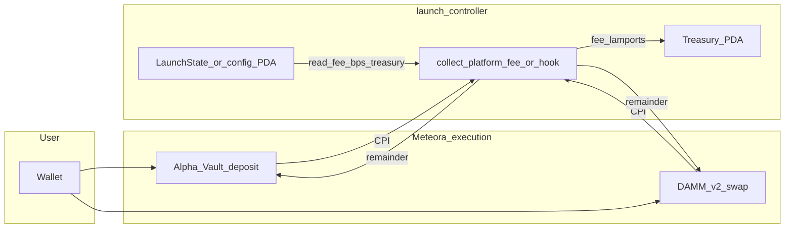
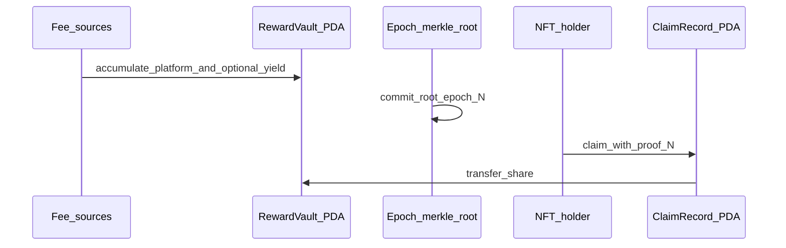

# On-chain monetization and NFT holder rewards (spec)

This document captures the **intended production architecture** for platform fees and holder rewards. Implementation is split across the Anchor `launch-controller` program, Meteora CPIs, and read-only UI/indexers.

**Hard rules**

- Backend and Supabase **never** compute authoritative fees, allocations, or claim outcomes.
- Frontend **never** simulates final payout authority; it displays RPC/indexer reads and unsigned tx previews only.
- Meteora (Alpha Vault, DAMM v2) remains the **execution venue**; fee splits are enforced **in-program via CPI**, not in Next.js or SQL.

---

## 1. Platform fee model (on-chain)

Configurable `platform_fee_bps` (per `LaunchState` or global config PDA). Monetizable surfaces:

1. Alpha Vault deposits (mint path).
2. DAMM v2 swaps (trading).
3. Optional secondary NFT trades (if routed through program-controlled accounts).

---

## 2. On-chain fee router (Anchor) — flow

**`PlatformFeeConfig`** (sketch): `fee_bps: u16`, `treasury: Pubkey`.

**Treasury PDA** seeds: `["treasury", program_id]`. Withdrawals only via admin multisig or timelocked instruction.

---

## 3. NFT holder reward distributor (on-chain)

**Preferred option:** Merkle root per epoch on-chain; claims carry Merkle proof. Alternative: deterministic on-chain formula (e.g. pro-rata with holding duration encoded in state) with **no** off-chain snapshot as authority.

Accounts (conceptual): `RewardVault` PDA, `ClaimRecord` (e.g. `["claim", nft_mint, epoch]`).

---

## 4. Meteora integration rules

- Alpha Vault: **deposit entry** only (no server-side “virtual” deposits).
- DAMM v2: **swap / liquidity** execution; trading fees feed the on-chain fee router.
- No backend fee math: all splits in Anchor around CPI.

---

## 5. Frontend components (to add / extend)

| Area | Components / routes |
|------|---------------------|
| Transparency | `FeeTransparencyPanel` — `platform_fee_bps`, estimated fee per action, treasury pubkey (read-only). |
| Rewards | `HolderRewardsDashboard` — claimable (RPC), epoch history, NFT multiplier (on-chain fields only). |
| Live | `LiveFeeFeed` — indexer-backed cumulative fees (read-only). |
| Launch | `/launch/[slug]` — vault state, read-only activity feed, lifecycle badge from chain. |
| Mint | `/mint/[slug]` — tx simulation preview, fee breakdown, success/failure state machine. |
| Project | `/project/[slug]` — unified dashboard: vault + DAMM + holder stats (all read paths). |

**UX infrastructure:** `src/lib/ui/design-tokens.ts` (spacing, typography, card/button primitives); route-level error boundaries; skeleton loading; React Query `staleTime` tuned for chain reads vs analytics; lazy-loaded trading/analytics modules.

---

## 6. Confirmations

| Statement | Status |
|-----------|--------|
| Platform monetization is fully on-chain | **Required** — fees split in Anchor around CPI; treasury PDA. |
| NFT rewards are not backend-simulated | **Required** — claims against on-chain root or formula; no Supabase snapshot as authority. |
| Meteora remains execution-only | **Required** — no lifecycle or allocation truth in Meteora configs alone. |

---

## 7. L2 observation layer (API)

L2 routes are enforced by **`enforcement-engine.ts`**: substring rules plus AST (`l2-ast-scanner.ts`) on **prebuild / CI** via **`src/lib/protocol/validate-protocol.ts`**. Runtime `enforceL2RouteModuleBoundary` uses the same engine; full AST at module load matches CI when **`L2_FULL_ENFORCE_AT_RUNTIME=1`** (otherwise substring-only so prod bundles need not load the TypeScript compiler).
