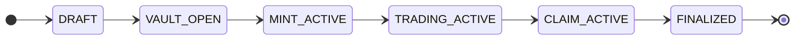
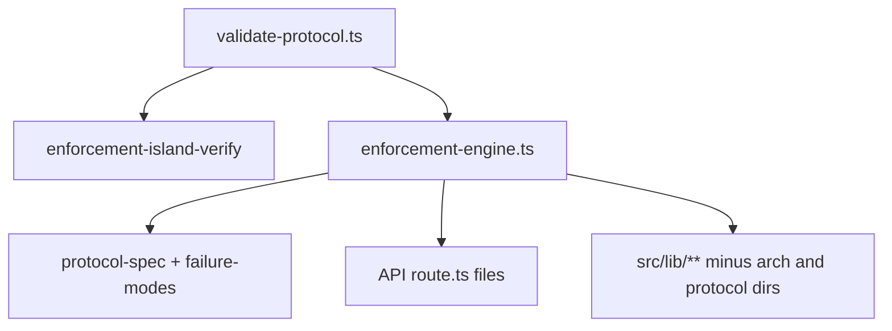

# Product architecture — runtime layers + protocol spec

This document **normalizes** how the Creator Launchpad is supposed to behave: **chain = truth**, **indexer + DB = read-only memory**, **Next.js = interface + unsigned tx assembly**, plus a **read-only protocol / invariants layer** for CI and governance. It complements `ARCHITECTURE_ENFORCEMENT.md` (trust boundaries) with a **product-facing** layering model.

---

## 1. Final model (text diagram)

```
┌─────────────────────────────────────────────────────────────────────────────┐
│ LAYER 1 — ON-CHAIN PROTOCOL (AUTHORITATIVE)                                  │
│   Anchor `launch-controller`: lifecycle, receipts, claims, vesting, custody   │
│   Meteora Alpha Vault: deposits / raise (CPI where program owns flow)       │
│   Meteora DAMM v2: swap + liquidity execution                                 │
│   Metaplex Core: NFT identity + collection binding                            │
│                                                                              │
│   Defines ONLY here: ownership · allocations · claims · lifecycle            │
│   No Next.js / Supabase / Helius may override or “simulate” these as law.    │
└─────────────────────────────────────────────────────────────────────────────┘
                                      ▲
                                      │ signed txs, account reads (RPC)
                                      │
┌─────────────────────────────────────────────────────────────────────────────┐
│ LAYER 2 — INDEXER / ANALYTICS (READ-ONLY)                                    │
│   Helius webhooks → stream events into Supabase (`chain_program_events`, etc.)│
│   Supabase: mirrors (addresses, stats, fee_distributions audit rows, rollups)│
│   Trending / reputation / ecosystem metrics                                   │
│                                                                              │
│   MAY: rank, aggregate, filter UI, invalidate cache                          │
│   MUST NOT: decide payouts, claims, allocations, or lifecycle                 │
└─────────────────────────────────────────────────────────────────────────────┘
                                      ▲
                                      │ HTTPS (GET/POST), no authority over L1
                                      │
┌─────────────────────────────────────────────────────────────────────────────┐
│ LAYER 3 — FRONTEND PRODUCT (UX + INTERACTION)                                │
│   Next.js App Router: discovery, create, mint, project pages, dashboard      │
│   Wallet session + Privy (optional)                                         │
│   API routes: auth, metadata, analytics reads, upload, AI copy assist        │
│                                                                              │
│   MAY: display state, show analytics, build **unsigned** txs from IDL/layout │
│   MUST NOT: treat DB/RPC aggregates as entitlement; compute token allocations│
└─────────────────────────────────────────────────────────────────────────────┘
                                      ▲
                                      │ consumed by CI + dev checks only
┌─────────────────────────────────────────────────────────────────────────────┐
│ LAYER 4 — PROTOCOL SPEC + INVARIANTS (VALIDATION ONLY, NOT EXECUTION)         │
│   `protocol-spec.ts`, `state-machine.ts`, `failure-modes.ts`                 │
│   `validate-protocol.ts` → `enforcement-engine.ts` + ESLint island            │
│                                                                              │
│   MAY: document guarantees, fail builds on drift, substring / AST hooks       │
│   MUST NOT: execute trades, mutate chain, or substitute L1 economics          │
└─────────────────────────────────────────────────────────────────────────────┘
```

**Rules (enforced design):**

| Rule | Statement |
|------|-----------|
| **A** | All **Solana protocol** financial outcomes (who owns what, what they can claim, launch phase) originate from **Anchor + Meteora on-chain state** and **signed transactions**. |
| **B** | **Supabase** is a **cache / audit mirror** for UX and operations—not a second source of truth for lifecycle or token allocation. |
| **C** | **Helius** is a **stream / RPC provider**: events and reads inform the mirror; they do not replace program rules. |
| **D** | **Frontend + Next API** are **view + tx-builder + session + commerce coordination**—not an allocation engine for Genesis economics. |

---

## 2. `/api` route classification

Legend: **✔ allowed** (fits layer 2/3). **⚠ scope note** (allowed but not L1). **✘ forbidden** (must not implement allocation / claim math as authority).

| Route | Layer | Classification |
|-------|--------|----------------|
| `GET/POST /api/launches/[slug]/reward-holders` | — | **✘ retired** — returns **410**; no server-side holder snapshots or payout batches. |
| `GET /api/launches/index` | 2→3 | **✔** Discovery read over published `collections` + sorts (UI only). |
| `GET /api/launches/[slug]/yield` | 2→3 | **✔** Aggregates **audit** rows in `fee_distributions` + listing fields for **display APR**; not a claim instruction. |
| `GET /api/launches/[slug]/signals/latest` | 2→3 | **✔** Read cached signals. |
| `POST /api/launches/[slug]/deploy` | 2 | **✔** Creator-auth’d **mirror** of deployment addresses/signatures into `collections`; **does not** set lifecycle `status` (commented in route). |
| `GET /api/creator/dashboard` | 2→3 | **✔** Reads collections + `fee_distributions` for **dashboard analytics** (sums shares already recorded in DB). |
| `POST /api/webhooks/helius` | 2 | **✔** Ingest / bump invalidation (stream). |
| `GET /api/reputation/[address]` | 2→3 | **✔** Read rollup (non-authoritative for token payouts). |
| `GET /api/ecosystem/signals-methodology` | 3 | **✔** Static methodology copy. |
| `GET/POST /api/metadata/*` | 2→3 | **✔** Metadata read/serve for UX. |
| `POST /api/upload/collection-asset` | 3 | **✔** Asset storage (non-financial). |
| `POST /api/ai/*` | 3 | **✔** Copy / image assist; **must not** be used as on-chain entitlement. |
| `POST /api/store/checkout` | 3 | **⚠** **Fiat storefront** order + inventory in **USD cents**; commerce math, **not** Genesis Pass allocation (separate domain from L1 token economics). |
| `GET/POST /api/referrals/*` | 2→3 | **✔** Attribution / leaderboard reads; `record` inserts referral row from mint + session (marketing analytics, not on-chain allocation). |
| `GET/POST /api/auth/*` | 3 | **✔** Sessions / identity. |
| `GET/POST /api/creator/profile` | 3 | **✔** Profile CRUD. |
| `POST /api/admin/verify-creator` | 3 | **✔** Platform moderation flag (`verified`); not token ownership. |
| `GET /api/health/supabase` | 3 | **✔** Health. |
| `GET /api/metadata/asset/[address]` | 2→3 | **✔** Asset metadata for display. |
| `GET /api/metadata/collection/[slug]` | 2→3 | **✔** Collection JSON for display. |
| `GET /api/metadata/token/[slug]` | 2→3 | **✔** Token metadata for display. |
| `POST /api/upload/collection-asset` | 3 | **✔** Upload to storage. |
| `POST /api/ai/launch-assist` | 3 | **✔** Structured suggestions for form fields. |
| `POST /api/ai/enrich-metadata-field` | 3 | **✔** Copy assist. |
| `POST /api/ai/enrich-token-metadata` | 3 | **✔** Copy assist. |
| `POST /api/ai/generate-full-project` | 3 | **✔** Form fill assist. |
| `POST /api/ai/generate-launch-image` | 3 | **✔** Image assist. |
| `GET/POST /api/auth/siws/*` | 3 | **✔** Wallet session (SIWS). |
| `GET/POST /api/auth/siwe/*` | 3 | **✔** SIWE (EVM) session hooks if used. |
| `GET/POST /api/auth/privy/*` | 3 | **✔** Privy session bridge. |
| `GET/POST /api/creator/profile` | 3 | **✔** Creator profile mirror. |
| `GET /api/referrals/me` | 2→3 | **✔** Read referral stats. |
| `POST /api/referrals/record` | 2→3 | **✔** Record attribution row (not on-chain claim). |
| `GET /api/referrals/leaderboard` | 2→3 | **✔** Read leaderboard. |
| `POST /api/admin/verify-creator` | 3 | **✔** Admin verification flag. |

Any future route that **plans** holder payouts, **computes** SPL shares server-side, or **accepts** client-supplied allocation tables as authority should be rejected by review (see `ARCHITECTURE_ENFORCEMENT.md` §3 removed patterns).

---

## 3. Incorrect authority already removed (historical)

The codebase explicitly **does not** ship server planners that mint money outcomes from math + DB:

- Removed / disabled patterns are listed in **`ARCHITECTURE_ENFORCEMENT.md` §3** (`planClaimAndDistribute`, `buildHolderPayoutTx`, old distribute APIs, etc.).
- **`reward-holders`** is a **hard 410** — no allocation or batch payout path.
- **`deploy`** updates **cached addresses** only; it does **not** flip `collections.status` as lifecycle (on-chain `LaunchState` is authoritative).

---

## 4. Product definition (clean, user-facing)

- **Launches are on-chain lifecycle objects** — progress and entitlements come from the **Anchor program** (and what it CPIs to on Meteora / Core), not from Supabase rows alone.
- **Alpha Vault** is the **deposit and distribution entry layer** for the raise (fundraising), as wired by the program and Meteora.
- **DAMM v2** is the **trading and liquidity execution layer** after the product exposes a pool; cached `damm_pool` on a card is for **routing / UX**, not lifecycle law.
- **The NFT (Metaplex Core)** is **identity plus participation** — the pass the user holds; rights to claim or vest are enforced **on-chain**, not by the web app.
- **Supabase** is an **analytics and operations mirror** — listings, referrals, optional fee **audit** rows, reputation rollups, discovery sorts.
- **Next.js** is the **interaction layer** — pages, wallet connect, unsigned transaction building, webhooks, AI-assisted copy, and (where applicable) **fiat storefront** checkout—not the authority for Genesis token allocation.

---

## 5. Confirmations (design intent vs. implementation)

| Assertion | Status |
|-------------|--------|
| No **off-chain** path defines **Genesis** allocation, vesting settlement, or claim **eligibility** as law. | **Yes** — enforcement doc + 410 routes + deploy behavior align. |
| All **Genesis-relevant** allocation logic lives **on-chain** in the program + vault/receipt accounts. | **Yes** — app reads/mirrors; it does not substitute. |
| Indexer + Helius + Supabase are **read-only** with respect to **L1 truth**. | **Yes** — they may write **mirrors** and **audit** rows derived from txs/events, not override `LaunchState`. |

---

## 6. Route inventory (file paths)

For a full file list under `src/app/api`, see the repository tree; this document’s table is the **normative classification**. When adding a route, update **§2** and ensure **Rules A–D** still hold.

---

## 7. Hard enforcement (build + ESLint)

| Mechanism | What it does |
|-------------|----------------|
| **`src/lib/architecture/layers.ts`** | Central registry: `ApiRouteLayer`, allowed module prefixes, forbidden imports/markers, optional `devWarnIfLayerViolation` (set `LAYER_DEV_WARNINGS=1` in dev to opt in). |
| **`@apiRouteLayer L2` / `L3` / `FORBIDDEN`** | **Mandatory** in a comment on every `src/app/api/**/route.ts` (e.g. ` * @apiRouteLayer L3` in the opening docblock). Next.js 16+ rejects extra `export` fields on route modules. Values: `L2` (analytics / mirrors / webhooks), `L3` (auth, AI, metadata, checkout), `FORBIDDEN` (must not ship — see below). |
| **`src/lib/protocol/validate-protocol.ts`** | **Single CI / prebuild entry** (`npm run prebuild`, `npm run enforce:protocol`, `npm run enforce:layers`): island verify, launch-state spine alignment, all API routes via **`enforceApiRoute`**, protocol failure-mode scan on `src/lib/**` (excluding `architecture/` + `protocol/` trees). |
| **`src/lib/protocol/protocol-spec.ts`** | READ-ONLY canonical spec: L1 economic model, `LaunchState` enum, pure invariant predicates (documentation + CI structural checks). |
| **`src/lib/protocol/state-machine.ts`** | READ-ONLY valid transitions on the lifecycle spine (no API mutation). |
| **`src/lib/protocol/failure-modes.ts`** | READ-ONLY CRITICAL failure taxonomy + substring / AST-hook metadata consumed by **`enforcement-engine.ts`**. |
| **`src/lib/architecture/l2-invariants.ts`** | Thin exports over **`enforcement-engine.ts`**. `enforceL2RouteModuleBoundary` uses the same engine as CI; AST at runtime is opt-in via **`L2_FULL_ENFORCE_AT_RUNTIME=1`** (default substring-only for smaller prod bundles). `assertL2Invariant(fn, code)` guards dynamic snippets. Set **`L2_INVARIANT_SOFT=1`** in development to warn instead of throw. |
| **`enforcement-policy.ts`** + **`enforcement-engine.ts`** | Architecture enforcement: forbidden lists, import bans, markers, AST toggles, plus **protocol failure-mode** scans (delegates AST only to `l2-ast-scanner.ts`). |
| **`docs/ONCHAIN_MONETIZATION_AND_REWARDS.md`** | Spec for on-chain platform fees, treasury PDA, holder reward distributor (Merkle epoch preferred), and frontend transparency panels — no backend fee authority. |
| **`docs/UI_CREATOR_MARKET.md`** | Creator-market UI map: components, routes, motion, gamification (non-financial), mobile + performance strategy, authority confirmations. |
| **`npm run enforce:protocol`** / **`npm run enforce:layers`** | Both invoke **`validate-protocol.ts`** (no separate layer script). |
| **`eslint.config.mjs`** | **`no-restricted-imports`** on `src/app/api/**` blocks `@/lib/launch-controller` and `@/lib/launch/reward-token-distribute` (compile-time / lint-time guard). |
| **`scripts/inject-api-route-layers.mjs`** | One-shot helper to insert `* @apiRouteLayer …` for mapped routes — or copy the tag line from any existing `route.ts`. |

**`FORBIDDEN`:** reserved for routes that must never reach production. If `VERCEL_ENV=production` or `NODE_ENV=production`, any `@apiRouteLayer FORBIDDEN` fails the prebuild. Prefer deleting the file or downgrading to `L3` with a 410 handler.

---

## 8. Protocol invariants layer (Layer 4 — governance / validation only)

This layer is **read-only at runtime**: it does not execute product behavior. It formalizes economic rules, lifecycle, on-chain guarantees, and failure-mode constraints so CI and the enforcement engine stay aligned with the Anchor program as the sole mutator of financial state.

### 8.1 Lifecycle spine (spec)



**Rule:** transitions are **monotonic** on this spine and **irreversible** except where the program explicitly defines admin/reset authority. **No API route** may assert lifecycle transitions as law; only the Anchor program mutates `LaunchState`.

### 8.2 Economic invariants (summary)

| Invariant | Statement |
|-----------|-----------|
| **No off-chain allocation** | Allocation that settles value must be derivable from on-chain state only (`protocol-spec.ts`). |
| **Fee integrity** | Authoritative `platform_fee_bps` / splits apply only inside **L1** CPI execution; L2/L3 do not compute fees as law. |
| **Claim safety** | `total_claimed <= total_vault_emitted` is an **on-chain** obligation; pure predicate in spec documents the relation for audits. |
| **NFT entitlement binding** | Claim eligibility maps through **LaunchState + MintReceipt** (and NFT ownership), not DB-inferred authority. |

### 8.3 Enforcement flow



1. **`validate-protocol.ts`** runs island checks + structural spec alignment, then **`enforceApiRoute`** on every API route (substring + L2 AST via existing scanner only).  
2. **`failure-modes.ts`** drives additional **CRITICAL** substring hooks on routes and on `src/lib/**` (excluding `architecture/` and `protocol/` trees so spec files do not self-match).  
3. **ESLint** continues to ban L1 imports in API routes (must stay lockstep with `enforcement-policy.ts`).

### 8.4 Formal failure modes (CRITICAL)

Defined in **`failure-modes.ts`** with descriptions, substring detection hooks, and reserved AST hook names:

- **ShadowAllocationDetected** — off-chain payout / allocation authority.  
- **IndexerBecomesAuthoritative** — L2/DB/analytics treated as entitlement source.  
- **DualSourceOfTruth** — competing chain vs DB financial authority.  
- **BackendPayoutLogicDetected** — server-side distribution / payout planning.

All are **CRITICAL**; matches surface in CI through **`validate-protocol.ts`**.
