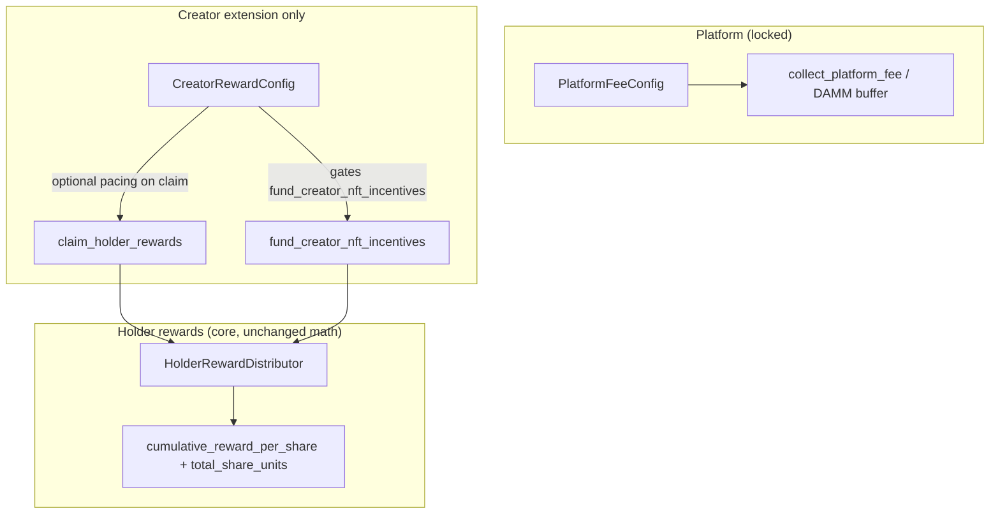

# CreatorRewardConfig — architecture (extension only)

This document describes the **creator-side extension** added alongside the locked platform / holder-index system. It does **not** change `PlatformFeeConfig`, `HolderRewardDistributor` math, `collect_platform_fee` / DAMM trading splits, or global BPS fields.

## Separation (L1)

- **Economically owed** rewards are still `claimable_rewards_floor(shares, cumulative_reward_per_share, reward_cursor)`.
- **CreatorRewardConfig** only applies **after** that value is computed: slot gates, linear vesting cap vs raw claimable, per-epoch SPL cap, and **inter-claim spacing** (`transfer_cooldown_slots` as minimum slots between claims — a stand-in until an explicit on-chain NFT transfer hook exists).

## Accounts

| Account | Owner |
|---------|--------|
| `CreatorRewardConfig` | Program PDA `["creator_reward_cfg", launch_state]` |
| `ClaimPosition` | Extended with `last_reward_epoch`, `claimed_this_epoch` for epoch caps |

**Migration:** existing `ClaimPosition` accounts must be resized or re-created for the new layout (dev / redeploy).

## Instructions

| Instruction | Who | Notes |
|-------------|-----|--------|
| `initialize_creator_reward_config` | `LaunchState.authority` (creator) | Once per launch (`init` PDA). Rejects `immutable_after_launch && lifecycle >= TRADING_ACTIVE`. |
| `update_creator_reward_config` | Creator | Blocked when `immutable_after_launch && lifecycle >= TRADING_ACTIVE`. Refreshes `schedule_anchor_slot` to current slot. |
| `fund_creator_nft_incentives` | Creator | Requires `creator_reward_share_bps > 0`. Pulls SPL from **creator treasury PDA** ATA into holder vault; uses the **same** index increment as `fund_holder_rewards_from_vault` (no new math). |
| `claim_holder_rewards` | Holder | Optional **first** `remaining_accounts` entry: deserialized `CreatorRewardConfig` PDA (must match seeds + program owner). |

## Events (indexing)

- `CreatorRewardConfigInitialized`
- `CreatorRewardConfigUpdated`
- `CreatorIncentiveFunded`
- `NFTClaimParametersApplied` (emitted when pacing was applied on a claim)

## L3 (frontend) copy rules

Use: **“configured by creator”**, **“derived from on-chain settings”**.  
Avoid implying guaranteed economics: no “expected earnings”, “guaranteed returns”, or “profit share”.

## Security / edge cases

1. **Optional config account** must be the canonical PDA and owned by the program; otherwise ignored.
2. **Epoch cap** uses `HolderRewardDistributor.distribution_epoch` vs `ClaimPosition.last_reward_epoch`.
3. **Vesting** is linear in slots from `schedule_anchor_slot + claim_start_delay_slots` over `vesting_duration_slots` (floor math favors solvency).
4. **Cooldown** enforces spacing using `last_claim_slot` (not a Metaplex transfer proof).
5. **fund_creator_nft_incentives** only moves SPL the creator treasury already holds; it does not mint platform funds.
